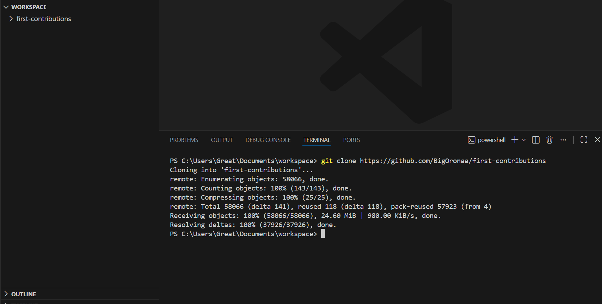
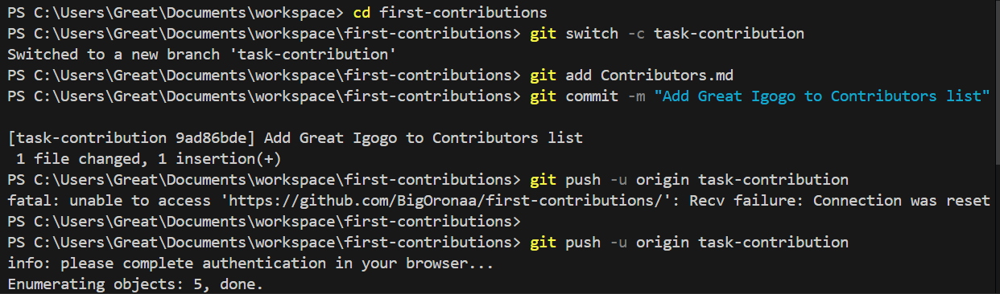
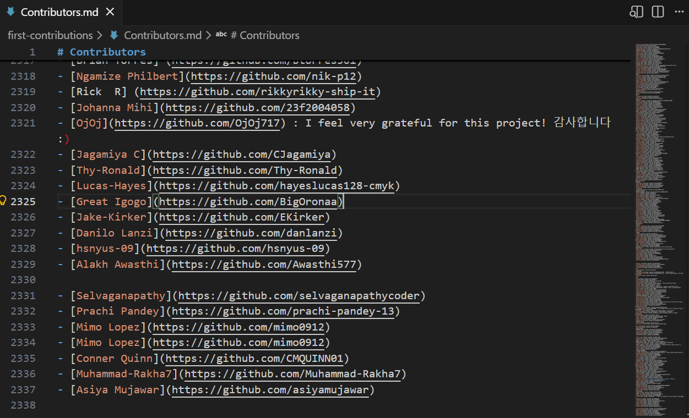
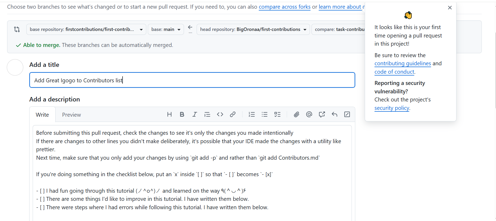
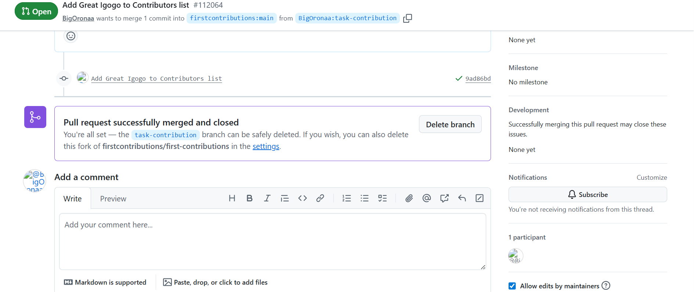

# First Contributors Open Source Task.

This task demonstrates the standard open-source contribution workflow, which typically follows the:

**Fork → Clone → Create Branch → Edit → Commit → Push → Pull Request process.**

The goal was to contribute to the First Contributors repository by adding my name to the contributors list and submitting the change through a Pull Request (PR). This workflow ensures proper collaboration, version control, and review before merging changes into the main project.

## Step-by-Step Process

### 1. Fork the Repository

First, I forked the original repository to my own GitHub account.

This created a copy of the repository under my GitHub profile.


### 2. Clone the Forked Repository

After forking, I cloned the repository to my local machine using VS Code terminal.
```bash
git clone https://github.com/BigOronaa/first-contributions.git
```
Then I moved into the project directory.
```bash
cd first-contributions
```




### 3. Create and Switch to a New Branch

To follow best practices, I created a new branch for my contribution instead of working directly on main.
```bash
git switch -c task-contribution
```
This created and switched to a new branch called:
```bash
task-contribution
```

### 4. Add My Name to the Contributors List

I opened the appropriate contributors file (usually Contributors.md) and added my name following the project’s format.




### 5. Stage and Commit the Changes

Next, I staged the modified file.
```bash
git add Contributors.md
```
Then I committed the changes with a meaningful message:
```bash
git commit -m "Add Great Igogo to Contributors list"
```

### 6. Push the Branch to GitHub

After committing locally, I pushed my branch to my forked repository:
```bash
git push origin task-contribution
```


### 7. Create a Pull Request

After the push was successful, I went to my GitHub repository.

- Clicked on Compare & pull request.

- Reviewed the changes.

- Clicked Create pull request.

This submitted my contribution for review and possible merge into the original repository.

- 
- 